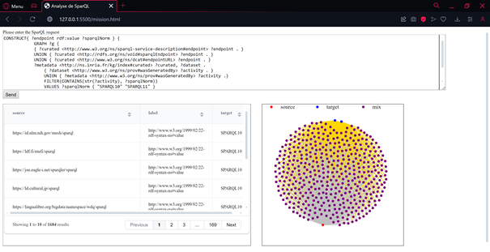

The LDViz library is a javascript library created in order to facilitate the creation of SPARQL graphs. When used, a website page is temporarily created, allowing the user to post a SPARQL request, and obtain the results in a table and in a graph results. Later, a graph pattern will be added to the page.

This presentation focus on the website, and is directed toward a user that don't want to go too much in the code.

# Website presentation

The website is a simple html page containing for the moment 3 major different parts.
I will go in detail to review each of them.



### Rajouter une photo de la page, why the website

## Part 1 : Text Area

The Text Area is the part where the user can enter the SPARQL request which he wants to see the graph of. Once the request is written, the user just have to use the "send" button under the Text Area.

### Expliquer utilisation requête

Here is an example of request :

```sparql

CONSTRUCT{ ?endpoint rdf:value ?sparqlNorm } {
    GRAPH ?g {
    { ?curated <http://www.w3.org/ns/sparql-service-description#endpoint> ?endpoint . }
    UNION { ?curated <http://rdfs.org/ns/void#sparqlEndpoint> ?endpoint . }
    UNION { ?curated <http://www.w3.org/ns/dcat#endpointURL> ?endpoint . }
    ?metadata <http://ns.inria.fr/kg/index#curated> ?curated, ?dataset .
        { ?dataset <http://www.w3.org/ns/prov#wasGeneratedBy> ?activity . }
        UNION { ?metadata <http://www.w3.org/ns/prov#wasGeneratedBy> ?activity .}
        FILTER(CONTAINS(str(?activity), ?sparqlNorm))
        VALUES ?sparqlNorm { "SPARQL10" "SPARQL11" }
    }
    }
    GROUP BY ?endpoint ?sparqlNorm
    ORDER BY ?endpoint ?sparqlNorm
            
```

The dataset obtained with this request should look like this:

## Part 2 : Table

The table contains the SPARQL results from the select. Those values are spread into x columns based on the variables given in the select part. We choosed 3 variables that will be the nodes and the links of the graph.

The table prints by default 10 lines of data at a time, but the user can explore them and change the lines.

Since there are for the moment no optionnal parameters in the function building the table, you need to simply input the dataset to call the table function in the code. For a user of the interface, there is no need to call anything except the dataset.

## Part 3 : Graph Results View

The graph results view is the visualisation of the graph result based on the query send by the user. A default graph is created when the request is send, but the user will be able to modify it.

For the color choices, 2 colors are choosen by default for the nodes (for the source and target), and for the nodes that are both source and target, a third color is created by mixing both colors.

The user can zoom on the graph or on specific nodes (by clicking on those nodes). They can also see the label of each nodes and each link below the table, when their mouse goes over the node or link in question.

# Things to improve

Add a support interaction that enable the user to choose the color of the different elements of the graph visualisation.

Add the possibility for the user to choose what is source, target, and relation in the request and the graph.

Allow the user to change the number of lines in the dataset.

Ajout que le graph result est un objet déclaré par le développeur suivi de 2 blocks (1 creation objet, puis appel à nodelink-dataset)
Refaire l'intro (en faire une vraie)


